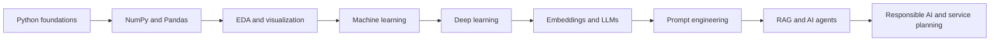

# EST AI Challengers 2026

This repository is the portfolio hub for my **EST AI Challengers 2026** training record. It organizes the non-hackathon part of the program as a traceable learning path from Python fundamentals to data analysis, machine learning, deep learning, LLM applications, RAG, AI agents, and responsible AI.

The Voice-Based Senior Wellbeing Monitoring System developed for the hackathon remains in its original separate private repository. Its code, documents, data, and presentation materials are intentionally not copied into this repository.

## Branch map

| Branch | Scope | Evidence |
| --- | --- | --- |
| [`learning/2026-training`](https://github.com/limshoon/est-ai-challengers/tree/learning/2026-training) | Day-by-day curriculum notes and personal reflections | 19 TIL documents covering Days 1, 2, and 4-20 |

Day 3 was not present in the available archive and has not been reconstructed or invented.

## Learning path

## Curriculum coverage

- Python syntax, functions, exceptions, and object-oriented programming
- NumPy and Pandas for analysis, preprocessing, and data integration
- Exploratory data analysis, descriptive statistics, and visualization
- Regression, classification, unsupervised learning, and model evaluation
- Keras and PyTorch fundamentals
- Embeddings, LLM usage, and prompt engineering
- Retrieval-augmented generation and AI-agent concepts
- Multimodal systems, AI ethics, privacy, copyright, bias, and governance
- Problem-first AI service planning and MVP scope management

## Portfolio intent

The records emphasize what was learned, what remained difficult, and what to practice next. They are evidence of an evolving learning process rather than a claim that every covered method is production-ready or mastered at an expert level.

## Repository policy

- `main` provides the program overview and navigation only.
- Learning notes live on `learning/2026-training` so the program record remains separate from later project repositories.
- Original lecture slides, handouts, datasets, and course backups are not redistributed.
- The Voice-Based Senior Wellbeing hackathon repository is explicitly outside this integration scope.
- Day 20 is retained only as a general lesson on hackathon workflow and AI-service planning; it contains no Voice-Based project implementation or artifacts.
- Credentials, private API keys, personal documents, and raw submission files are excluded.

## 한국어 안내

이 저장소는 **EST AI 챌린저스 2026 교육 과정**의 비해커톤 자료를 통합한 포트폴리오 허브입니다. Python 기초부터 데이터 분석, 머신러닝·딥러닝, LLM·RAG·AI Agent, AI 윤리와 서비스 기획까지의 개인 학습 기록을 `learning/2026-training` 브랜치에 정리했습니다.

`Voice-Based Senior Wellbeing Monitoring System` 해커톤 저장소는 요청에 따라 기존 비공개 저장소에 그대로 유지하며, 해당 프로젝트의 코드·문서·데이터·발표자료는 이 저장소에 포함하지 않았습니다.

## Rights and reuse

The original learning notes are provided for portfolio viewing. Course names and referenced technologies belong to their respective owners. No original course materials are redistributed here.
